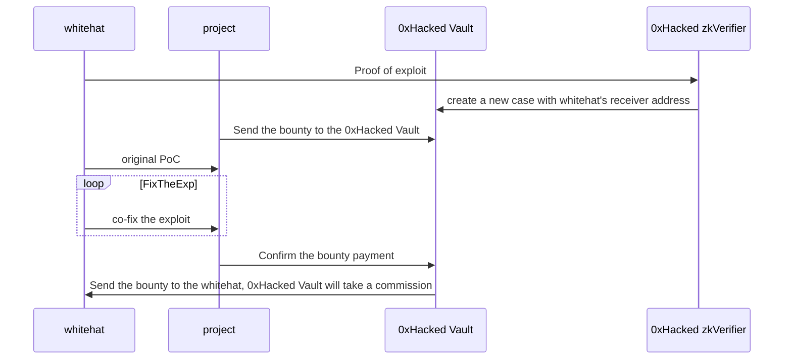

# 0xHacked Vault

## Design

If the whitehat doesn’t provide the PoC or the PoC doesn’t work after the project sends the bounty to the Vault, the reward will be locked in the 0xHacked Vault. Also, if the project doesn’t confirm the payment after fixing the exploit, they can’t get the deposit back guaranteed by our smart contract.
